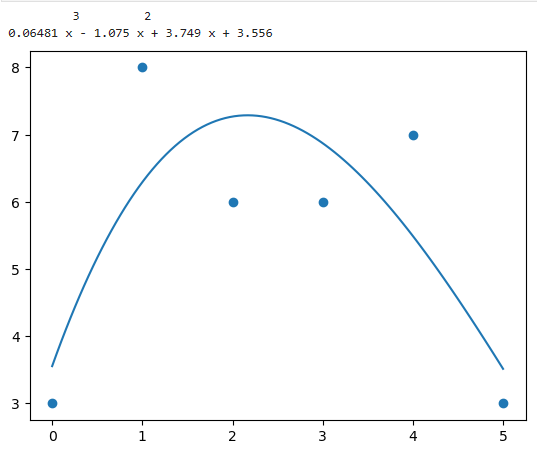
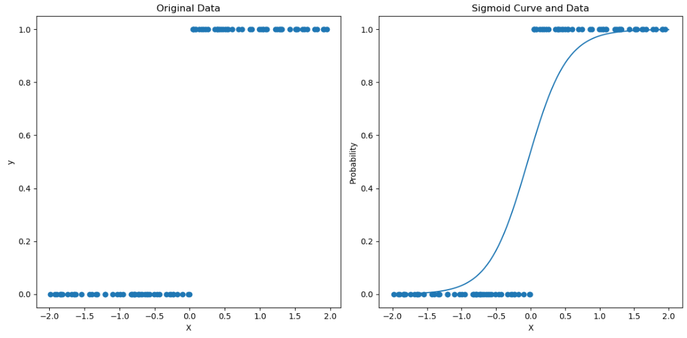
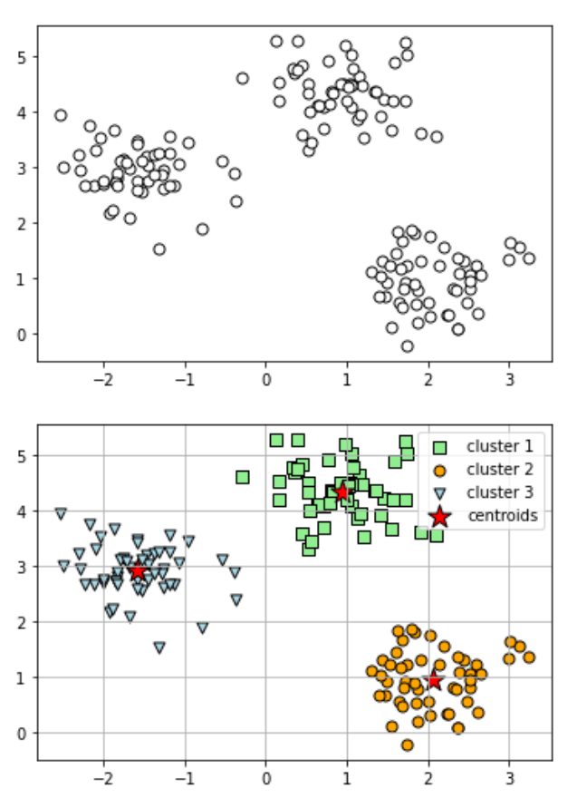
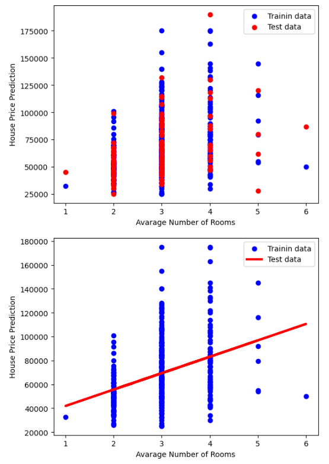
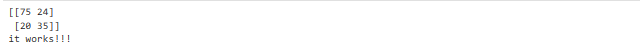
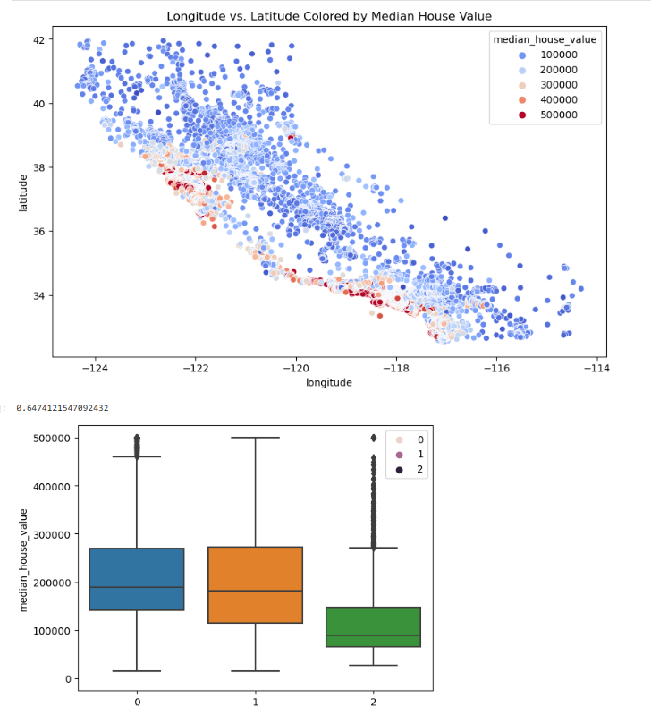

# W03 - Supervised Learning: Regression & Unsupervised Learning

### Lecture Example 1: Supervised learning - Linear Regression - W03_Lecture_Page7
```
#Example 3.15 Linear Regression
import matplotlib.pyplot as plt
from scipy import stats
x = [0,1,2,3,4]
y = [3,5,5,6,7]
slope, intercept, r, p , std_err = stats.linregress(x,y)
print("slope: ", slope)
print("intercept: ", intercept)

def myfunc(x):
    return slope * x + intercept

mymodel = list(map(myfunc,x))
plt.scatter(x,y)
plt.plot(x,mymodel)
plt.show()

```

### Lecture Example 1: Explanations:
```
# Explanation:

# 1. Import Libraries:
#   - import matplotlib.pyplot as plt: Importing the matplotlib.pyplot module for visualization.
#   - from scipy import stats: Importing the stats module from SciPy for statistical operations.

# 2. Data Preparation:
#   - x = [0,1,2,3,4]: Independent variable (predictor).
#   - y = [3,5,5,6,7]: Dependent variable (response).

# 3. Linear Regression:
#   - slope, intercept, r, p , std_err = stats.linregress(x,y): Using stats.linregress() to perform linear regression on the data. It returns several values:
#       - slope: Slope of the regression line.
#       - intercept: Intercept of the regression line.
#       - r: Correlation coefficient.
#       - p: Two-tailed p-value for a hypothesis test whose null hypothesis is that the slope is zero.
#       - std_err: Standard error of the estimated gradient.

# 4. Define Linear Function:
#   - def myfunc(x): return slope * x + intercept: Defines a linear function myfunc based on the calculated slope and intercept.

# 5. Generate Model Predictions:
#   - mymodel = list(map(myfunc,x)): Generates model predictions for each value of x using the defined linear function.

# 6. Plotting:
#   - plt.scatter(x,y): Plots the original data points as a scatter plot.
#   - plt.plot(x,mymodel): Plots the regression line based on the model predictions.
#   - plt.show(): Displays the plot with data points and the regression line.

# 7. Output:
#   - The script prints the calculated slope and intercept.```

```

Output:


### Lecture Example 2: Supervised learning - NonLinear Regression(Polynomial Regression) - W03_Lecture_Page7
```
#Example 3.16 Polynomial Regression
import matplotlib.pyplot as plt
from scipy import stats
import numpy as np

x = [0,1,2,3,4,5]
y = [3,8,6,6,7,3]

mymodel = np.poly1d(np.polyfit(x, y, 3))

print(mymodel)

myline = np.linspace(0, 5, 100)

plt.scatter(x,y)
plt.plot(myline,mymodel(myline))
plt.show()
```
### Lecture Example 2: Explanations:
```
# Explanation:

# 1. Import Libraries:
#   - import matplotlib.pyplot as plt: Importing the matplotlib.pyplot module for visualization.
#   - from scipy import stats: Importing the stats module from SciPy for statistical operations.
#   - import numpy as np: Importing the numpy module for numerical operations.

# 2. Data Preparation:
#   - x = [0,1,2,3,4,5]: Independent variable (predictor).
#   - y = [3,8,6,6,7,3]: Dependent variable (response).

# 3. Polynomial Regression:
#   - mymodel = np.poly1d(np.polyfit(x, y, 3)): Using np.polyfit() to perform polynomial regression on the data. 
#     It fits a polynomial of degree 3 to the data and returns a polynomial model as a numpy poly1d object.

# 4. Generate Model Predictions:
#   - myline = np.linspace(0, 5, 100): Generates 100 evenly spaced points between 0 and 5 as the x-values for plotting the regression line.
#   - mymodel(myline): Evaluates the polynomial model at each point in myline to generate the y-values for plotting the regression line.

# 5. Plotting:
#   - plt.scatter(x,y): Plots the original data points as a scatter plot.
#   - plt.plot(myline,mymodel(myline)): Plots the polynomial regression line based on the model predictions.
#   - plt.show(): Displays the plot with data points and the regression line.

# 6. Output:
#   - The script prints the polynomial model representing the regression line.
```


Output:

  


### Lecture Example 3: Supervised learning - NonLinear Regression - LogisticRegression - W03_Lecture_Page14
```
import numpy as np
import matplotlib.pyplot as plt
from sklearn.linear_model import LogisticRegression

# Generate sample data
np.random.seed(10)
X = np.random.rand(100, 1) * 4 - 2 # Create random x values between -2 and 2 
y = (np.sin(X) > 0).astype(int) # Generate binary labels based on sine function


# Create Logistic regression model

model = LogisticRegression()
model.fit(X, y)

# Generate x values for plotting the sigmoid curve 
x_plot = np.linspace(-2, 2, 100)


# Calculate predicted probabilities for the plot 
y_pred = model.predict_proba (x_plot.reshape(-1, 1))[:, 1]


# Create the plot
plt.figure(figsize=(12, 6))

# Left plot: Original data
plt.subplot(1, 2, 1)
plt.scatter(X, y)
plt.xlabel("X")
plt.ylabel("y")
plt.title("Original Data")

#Right plot: Sigmoid curve and data
plt.subplot(1, 2, 2)
plt.plot(x_plot, y_pred)
plt.scatter(X, y)
plt.xlabel("X")
plt.ylabel("Probability")
plt.title("Sigmoid Curve and Data")

plt.tight_layout()
plt.show()
```

### Lecture Example 1: Explanations:
```
# Explanation:

# 1. Import Libraries:
#   - import numpy as np: Importing the numpy module for numerical operations.
#   - import matplotlib.pyplot as plt: Importing the matplotlib.pyplot module for visualization.
#   - from sklearn.linear_model import LogisticRegression: Importing LogisticRegression model from sklearn for logistic regression.

# 2. Generate Sample Data:
#   - X = np.random.rand(100, 1) * 4 - 2: Generates random x values between -2 and 2.
#   - y = (np.sin(X) > 0).astype(int): Generates binary labels based on whether the sine of X is greater than 0.

# 3. Create Logistic Regression Model:
#   - model = LogisticRegression(): Creates a Logistic Regression model.
#   - model.fit(X, y): Fits the model to the sample data.

# 4. Generate x Values for Plotting the Sigmoid Curve:
#   - x_plot = np.linspace(-2, 2, 100): Generates 100 evenly spaced x values between -2 and 2.

# 5. Calculate Predicted Probabilities for the Plot:
#   - y_pred = model.predict_proba(x_plot.reshape(-1, 1))[:, 1]: Calculates the predicted probabilities for positive class (y=1) using the trained logistic regression model.

# 6. Create the Plot:
#   - plt.figure(figsize=(12, 6)): Sets the figure size.
#   - Left plot: Original Data:
#       - plt.subplot(1, 2, 1): Specifies a subplot grid of 1 row and 2 columns, selects the first subplot.
#       - plt.scatter(X, y): Plots the original data points.
#   - Right plot: Sigmoid Curve and Data:
#       - plt.subplot(1, 2, 2): Specifies the second subplot.
#       - plt.plot(x_plot, y_pred): Plots the sigmoid curve using the predicted probabilities.
#       - plt.scatter(X, y): Overlays the original data points on the sigmoid curve plot.

# 7. Display the Plot:
#   - plt.tight_layout(): Adjusts subplot parameters to give specified padding.
#   - plt.show(): Displays the plot.
```

Output:




### Lecture Example 4: UnSupervised learning - K-means Clustering - W03_Lecture_Page23
```
# Set the environment variable
import os
os.environ["OMP_NUM_THREADS"] = "1"

import matplotlib.pyplot as plt
from sklearn.datasets import make_blobs
from sklearn.cluster import KMeans

# create dataset
X, y = make_blobs(
    n_samples=150, n_features=2,
    centers=3, cluster_std=0.5,
    shuffle=True, random_state=0
)

# plot
plt.scatter(
    X[:, 0], X[:, 1],
    c='white', marker='o',
    edgecolor='black', s=50
)
plt.show()

km = KMeans(
    n_clusters=3, init='random',
    n_init=10, max_iter=300,
    tol=1e-04, random_state=0
)
y_km = km.fit_predict(X)

# plot the 3 clusters
plt.scatter(
    X[y_km == 0, 0], X[y_km == 0, 1],
    s=50, c='lightgreen',
    marker='s', edgecolor='black',
    label='cluster 1'
)

plt.scatter(
     X[y_km == 1, 0], X[y_km == 1, 1],
     s=50, c='orange',
     marker='o', edgecolor='black',
     label='cluster 2'
)

plt.scatter(
     X[y_km == 2, 0], X[y_km ==2 ,1],
     s=50,c ='lightblue',
     marker ='v',edgecolor ='black' ,
      label ='cluster3'
 )

 #plot the centroids 
plt.scatter(
      km.cluster_centers_[:,0] ,km.cluster_centers_[:,1],
      s =250 ,marker ='*' ,
      c ='red' ,edgecolor ='black' ,
       label ='centroids'
 )
plt.legend(scatterpoints =1)
plt.grid()
plt.show()
```

### Example 4 Explanation of Python code for K-Means Clustering: Lecture Example 4
```
1. Import Libraries:
•	matplotlib.pyplot as plt: Used for creating visualizations (plots). 
•	from sklearn.datasets import make_blobs: Imports the make_blobs function for generating sample data with clusters. 
•	from sklearn.cluster import KMeans: Imports the KMeans class for performing KMeans clustering. 
2. Create Sample Dataset:
•	X, y = make_blobs(...): This line generates a sample dataset using the make_blobs function. Here's what the parameters control: 
•	n_samples=150: Creates 150 data points. 
•	n_features=2: Each data point will have 2 features (think of X and Y coordinates). 
•	centers=3: Creates 3 clusters in the data. 
•	cluster_std=0.5: Controls the spread of data points within each cluster (higher value increases spread). 
•	shuffle=True: Randomly shuffles the data points. 
•	random_state=0: Sets a seed for reproducibility (ensures the same data generation each time). 
3. Visualize Dataset:
•	plt.scatter(...): Creates a scatter plot of the generated data points. 
•	X[:, 0]: Selects the first feature (X-coordinate) from all data points (represented by ':'). 
•	X[:, 1]: Selects the second feature (Y-coordinate) from all data points. 
•	c='white': Sets the marker color to white. 
•	marker='o': Sets the marker shape to circles. 
•	edgecolor='black': Sets the edge color of the markers to black. 
•	s=50: Sets the size of the markers to 50 points. 
•	plt.show(): Displays the generated scatter plot. 
4. KMeans Clustering:
•	km = KMeans(...): Creates a KMeans object with the following parameters: 
•	n_clusters=3: Specifies the number of clusters to find (matches the number of centers in the data). 
•	init='random': Initializes the centroids (cluster centers) randomly. 
•	n_init=10: Runs the KMeans algorithm 10 times with different random initializations (helps find a better solution). 
•	max_iter=300: Sets the maximum number of iterations allowed for the algorithm. 
•	tol=1e-04: Sets the tolerance level for convergence (algorithm stops if changes in centroids are smaller than this value). 
•	random_state=0: Sets a seed for reproducibility (ensures consistent cluster assignments). 
•	y_km = km.fit_predict(X): 
•	fit(X): Trains the KMeans model on the data X. This process involves assigning data points to their closest centroids and iteratively updating the centroids based on these assignments. 
•	predict(X): Predicts the cluster labels for each data point in X. The output (y_km) is an array where each element represents the cluster number (0, 1, or 2) assigned to the corresponding data point in X. 
5. Visualize Clusters and Centroids:
•	Three plt.scatter calls: These create scatter plots for each cluster, differentiated by color, marker shape, and label. The code uses conditional indexing (e.g., X[y_km == 0, 0]) to select data points belonging to each cluster based on their predicted labels (y_km). 
•	plt.scatter: This creates a scatter plot for the centroids (cluster centers) identified by the KMeans algorithm. 
6. Display the plot:
•	plt.legend(scatterpoints=1): Adds a legend to the plot, including the markers for clusters and centroids. 
•	plt.grid(): Adds a grid to the plot for better visualization. 
•	plt.show(): Displays the final plot showing the data points colored by their assigned clusters and the centroids marked with stars. 
```
Output:




### Tutorial Example1: Supervised learning - Linear Regression - W03 Tutorial Page5
```
## Supervised Learning - Linear Regression

# Tutorial on Linear Regression 
# - Given a dataset of house prices in Boston, USA.
# - If price is the dependent variable, determine which single indpendent variable will best predict the price. 

import matplotlib
import matplotlib.pyplot as plt
import numpy as np
from sklearn import linear_model
import pandas as pd
from sklearn.model_selection import train_test_split

# Import boston.csv and define which column(s) to use

df = pd.read_csv('boston.csv')
X = df[['bedrooms']] #independet variable
y = df['price'] #dependant variable

# Segment the data into the training and test sets
X_train, X_test, y_train, y_test = train_test_split(X, y, test_size=0.2, random_state=42)

# Visualise the data in a scatter plot before running a linear regression 

plt.scatter(X_train, y_train, color='blue', label='Trainin data')
plt.scatter(X_test, y_test, color='red', label='Test data')
plt.xlabel('Avarage Number of Rooms')
plt.ylabel('House Price Prediction')
plt.legend()
plt.show()

# Initialise and train the linear regression model

model = linear_model.LinearRegression()
model.fit(X_train, y_train)

# Prediction

y_predict = model.predict(X_test)

# Visualizing the outputs

plt.scatter(X_train, y_train, color='blue', label='Trainin data')
plt.plot(X_test, y_predict, color='red',linewidth=3, label='Test data')
plt.xlabel('Avarage Number of Rooms')
plt.ylabel('House Price Prediction')
plt.legend()
plt.show()
```

### Tutorial Example 1: Explanation
```
# Explanation:

# 1. Import Libraries:
#    - import matplotlib.pyplot as plt: Importing the matplotlib.pyplot module for visualization.
#    - import numpy as np: Importing the numpy module for numerical operations.
#    - from sklearn import linear_model: Importing the linear_model module from scikit-learn for linear regression.
#    - import pandas as pd: Importing the pandas module for data manipulation.
#    - from sklearn.model_selection import train_test_split: Importing the train_test_split function from scikit-learn for splitting the dataset into training and test sets.

# 2. Import Dataset and Define Variables:
#    - df = pd.read_csv('boston.csv'): Reading the dataset from 'boston.csv' file using pandas.
#    - X = df[['bedrooms']]: Defining the independent variable (X) as 'bedrooms'.
#    - y = df['price']: Defining the dependent variable (y) as 'price'.

# 3. Segment Data into Training and Test Sets:
#    - X_train, X_test, y_train, y_test = train_test_split(X, y, test_size=0.2, random_state=42): Splitting the dataset into training and test sets with 80% for training and 20% for testing.

# 4. Visualize the Data:
#    - plt.scatter(...): Plotting the training and test data points on a scatter plot.

# 5. Initialize and Train Linear Regression Model:
#    - model = linear_model.LinearRegression(): Initializing a linear regression model.
#    - model.fit(X_train, y_train): Training the model using the training data.

# 6. Prediction:
#    - y_predict = model.predict(X_test): Making predictions on the test data.

# 7. Visualize the Outputs:
#    - plt.scatter(...): Plotting the training data points.
#    - plt.plot(...): Plotting the predicted values on the test data.
```


Output:



### Tutorial Example 2: Supervised learning - NonLinear Regression - LogisticRegression - W03_Tutorial_Page6
```
#Heart attack dataset
#import Python libraries and load dataset 'heartattack.csv'

import matplotlib
import matplotlib.pyplot as plt
import numpy as np
from sklearn.linear_model import LogisticRegression
import pandas as pd
from sklearn.model_selection import train_test_split
from sklearn.metrics import classification_report, confusion_matrix

#split dataset in features and target variable

df = pd.read_csv('heartattack.csv')
X = df.drop('Label', axis = 1)
y = df['Label']

# split X and y into training and testing sets

X_train, X_test, y_train, y_test = train_test_split(X, y, test_size=0.2, random_state=42)

# instantiate the model (using the default parameters)

model = linear_model.LogisticRegression()

# fit the model with training data, and run prediction on testing data

model.fit(X_train, y_train)
y_predict = model.predict(X_test)

# Model Evaluation using Confusion Matrix 

cm = confusion_matrix(y_test, y_predict)
print (cm)


print('it works!!!')
```

Output:




## Tutorial Example 3: UnSupervised learning - K-means Clustering - W03_Tutorial_Page7
```
## K-means Clustering (Unsupervised Learning)

import pandas as pd
import seaborn as sns
import matplotlib.pyplot as plt
from sklearn.model_selection import train_test_split
from sklearn import preprocessing
from sklearn.cluster import KMeans
from sklearn.metrics import silhouette_score
from sklearn.preprocessing import StandardScaler


# Exploratory Data Analysis on townships dataset to identify hidden patterns in locations 
# and house median prices 
df = pd.read_csv('townships.csv')

# Use pandas to read in townships dataset and focus on 'longitude', 'latidude', and 'median_house_value'

data = df[['longitude', 'latitude', 'median_house_value']]

# Use Seaborn scatterplot to plot 'longitude' against 'latitude', using 'median_house_value' as the hue (or colour)
plt.figure(figsize=(10, 6))
sns.scatterplot (data=data, x='longitude', y='latitude', hue='median_house_value', palette='coolwarm') 
plt.title('Longitude vs. Latitude Colored by Median House Value')
plt.show()

# Use sklearn train_test_split to split training set (2/3) and testing set (1/3) of the total dataset 
X = data[['longitude', 'latitude']] # Features for clustering
y = data[['median_house_value']] # Target variable
X_train, X_test, y_train, y_test = train_test_split(X, y, test_size=1/3, random_state=42)

# Use sklearn preprocessing to normalize the columns in the data. Why?
scaler = StandardScaler()
X_train_norm = scaler.fit_transform (X_train)
X_test_norm = scaler.transform(X_test)

# Create a KMeans object, assign k = 3 initially, and execute clustering using fit
# Create a KMeans object, assign k = 3 initially, and execute clustering using fit 
kmeans = KMeans (n_clusters=3, random_state=42, n_init=10)
kmeans.fit(X_train_norm)


# Uncomment and use the next three lines of code to plot your results
sns.scatterplot(data = X_train, x = 'longitude', y = 'latitude', hue = kmeans.labels_)
sns.boxplot(x = kmeans.labels_, y = y_train['median_house_value'])
silhouette_score(X_train_norm, kmeans.labels_, metric='euclidean')
```

Output:




