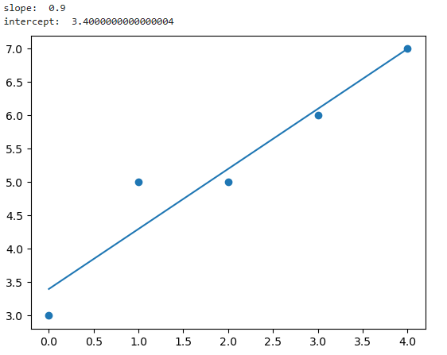

# W03 - Supervised Learning: Regression & Unsupervised Learning

### Lecture Example 1: Supervised learning - Linear Regression - W03_Lecture_Page7
```
#Example 3.15 Linear Regression
import matplotlib.pyplot as plt
from scipy import stats
x = [0,1,2,3,4]
y = [3,5,5,6,7]
slope, intercept, r, p , std_err = stats.linregress(x,y)
print("slope: ", slope)
print("intercept: ", intercept)

def myfunc(x):
    return slope * x + intercept

mymodel = list(map(myfunc,x))
plt.scatter(x,y)
plt.plot(x,mymodel)
plt.show()
```


```
1. Import Libraries:
•	matplotlib.pyplot as plt: Used for creating visualizations (plots). 
•	from sklearn.datasets import make_blobs: Imports the make_blobs function for generating sample data with clusters. 
•	from sklearn.cluster import KMeans: Imports the KMeans class for performing KMeans clustering. 
2. Create Sample Dataset:
•	X, y = make_blobs(...): This line generates a sample dataset using the make_blobs function. Here's what the parameters control: 
•	n_samples=150: Creates 150 data points. 
•	n_features=2: Each data point will have 2 features (think of X and Y coordinates). 
•	centers=3: Creates 3 clusters in the data. 
•	cluster_std=0.5: Controls the spread of data points within each cluster (higher value increases spread). 
•	shuffle=True: Randomly shuffles the data points. 
•	random_state=0: Sets a seed for reproducibility (ensures the same data generation each time). 
3. Visualize Dataset:
•	plt.scatter(...): Creates a scatter plot of the generated data points. 
•	X[:, 0]: Selects the first feature (X-coordinate) from all data points (represented by ':'). 
•	X[:, 1]: Selects the second feature (Y-coordinate) from all data points. 
•	c='white': Sets the marker color to white. 
•	marker='o': Sets the marker shape to circles. 
•	edgecolor='black': Sets the edge color of the markers to black. 
•	s=50: Sets the size of the markers to 50 points. 
•	plt.show(): Displays the generated scatter plot. 
4. KMeans Clustering:
•	km = KMeans(...): Creates a KMeans object with the following parameters: 
•	n_clusters=3: Specifies the number of clusters to find (matches the number of centers in the data). 
•	init='random': Initializes the centroids (cluster centers) randomly. 
•	n_init=10: Runs the KMeans algorithm 10 times with different random initializations (helps find a better solution). 
•	max_iter=300: Sets the maximum number of iterations allowed for the algorithm. 
•	tol=1e-04: Sets the tolerance level for convergence (algorithm stops if changes in centroids are smaller than this value). 
•	random_state=0: Sets a seed for reproducibility (ensures consistent cluster assignments). 
•	y_km = km.fit_predict(X): 
•	fit(X): Trains the KMeans model on the data X. This process involves assigning data points to their closest centroids and iteratively updating the centroids based on these assignments. 
•	predict(X): Predicts the cluster labels for each data point in X. The output (y_km) is an array where each element represents the cluster number (0, 1, or 2) assigned to the corresponding data point in X. 
5. Visualize Clusters and Centroids:
•	Three plt.scatter calls: These create scatter plots for each cluster, differentiated by color, marker shape, and label. The code uses conditional indexing (e.g., X[y_km == 0, 0]) to select data points belonging to each cluster based on their predicted labels (y_km). 
•	plt.scatter: This creates a scatter plot for the centroids (cluster centers) identified by the KMeans algorithm. 
6. Display the plot:
•	plt.legend(scatterpoints=1): Adds a legend to the plot, including the markers for clusters and centroids. 
•	plt.grid(): Adds a grid to the plot for better visualization. 
•	plt.show(): Displays the final plot showing the data points colored by their assigned clusters and the centroids marked with stars. 


```
