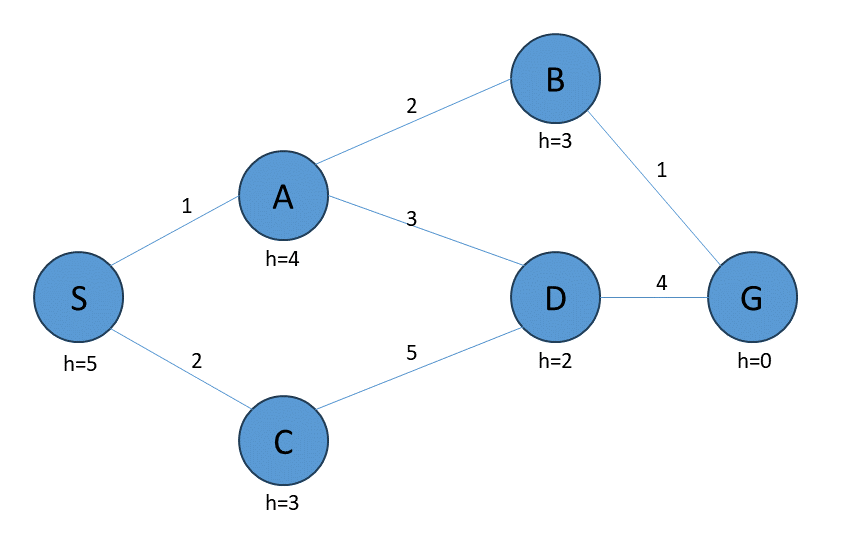

# W05 - Heuristic Search Techniques

### Tutorial Example 1: Heuristic Search Techniques - W05_Tutorial_Page4

## 




## DFS (Uninformed Search) and A* (Informed Search)
```
## Tutorial Example 1: Heuristic Search Techniques - W05_Tutorial_Page4
## DFS (Uninformed Search) and A* (Informed Search)

# Graph representation
# Define nodes and their neighbors along with the cost of traversal between them.
graph = {
    'S': {'A': 1, 'C': 2},
    'A': {'B': 2, 'D': 3},
    'B': {'G': 1},
    'C': {'D': 5},
    'D': {'G': 4},
    'G': {}
}

#  Question 1: What data structure did we use to represent the graph in Python?
'''
Answer 1: The graph is represented using a dictionary in Python, where each node 
   is a key, and its value is another dictionary containing the adjacent nodes as keys 
   and the corresponding edge costs as values.


The data structures that can be used to represent the graph:

1) Dictionary: In this representation, each node is a key in the outer dictionary, and its 
corresponding value is another dictionary containing adjacent nodes as keys and the 
corresponding edge weights as values. This structure provides direct access to neighboring 
nodes and their edge weights.

{
    'S': {'A': 1, 'C': 2},
    'A': {'B': 2, 'D': 3},
    'B': {'G': 1},
    'C': {'D': 5},
    'D': {'G': 4},
    'G': {}
}


2) Adjacency Matrix: This is a 2D matrix where each cell indicates the presence or absence 
of an edge between two nodes. It's efficient for dense graphs but can be memory-intensive.

     S  A  B  C  D  G
  S  0  1  0  2  0  0
  A  0  0  2  0  3  0
  B  0  0  0  0  0  1
  C  0  0  0  0  5  0
  D  0  0  0  0  0  4
  G  0  0  0  0  0  0
  
3) Edge List: This is a list of tuples representing the edges in the graph, along with their 
weights. It's straightforward and memory-efficient but might be less efficient for edge lookup.
  
  [('S', 'A', 1), ('S', 'C', 2), ('A', 'B', 2), ('A', 'D', 3), ('B', 'G', 1), ('C', 'D', 5), ('D', 'G', 4)]


4) Incidence Matrix: This is a 2D matrix where rows represent nodes and columns represent edges. 
It's suitable for both directed and undirected graphs but can be memory-intensive, especially 
for large graphs. n this matrix representation, each row corresponds to a node, each column 
corresponds to an edge, and the value at (i, j) indicates whether node i is incident to edge j.

      e1  e2  e3  e4  e5  e6
  S   1   1   0   0   0   0
  A   1   0   1   1   0   0
  B   0   0   1   0   1   0
  C   0   1   0   0   1   0
  D   0   0   0   1   0   1
  G   0   0   0   0   0   1

'''

## Define a function to perform Depth-First Search.

def dfs(graph, start, goal):
    # Initialize a stack with a tuple containing the start node and a list containing only the start node
    stack = [(start, [start])]

    # Loop until the stack is empty
    while stack:
        # Pop the top element from the stack, which is a tuple containing the current node and its path
        (node, path) = stack.pop()

        # Check if the current node is the goal node
        if node == goal:
            # If it is, return the path from the start node to the goal node
            return path

        # Iterate through the adjacent nodes of the current node in the graph
        for next_node in graph[node]:
            # Check if the adjacent node has not been visited before
            if next_node not in path:
                # If it hasn't, push a tuple containing the adjacent node and the updated path to the stack
                stack.append((next_node, path + [next_node]))

    # If the goal node is not found after exploring all possible paths, return None
    return None

# Question 2: What data structure did we use to implement DFS?
'''
Answer 2: DFS (Depth-First Search) is implemented using a stack data structure.

'''

# Call the DFS function to find the path from 'S' to 'G’.
dfs_path = dfs(graph, 'S','G')
print("DFS Path:",dfs_path)

#  Question 3: What is the output of the DFS function for the given graph?
'''
  Answer 3:The output of the DFS function for the given graph is the path from the 
 start node 'S' to the goal node 'G' following the depth-first search strategy.
'''

# Define a function to perform A* search.
def astar(graph, start, goal, heuristic):
    # Initialize the open list with a tuple containing the heuristic value for the start node,
    # the actual cost from the start node (0 initially), the start node itself, and the path containing only the start node
    open_list = [(heuristic(start), 0, start, [start])]
    
    # Initialize the closed list as an empty set to keep track of visited nodes
    closed_list = set()

    # Continue looping while there are nodes in the open list
    while open_list:
        # Sort the open list based on the first element of each tuple, which represents the total cost f
        open_list.sort()
        
        # Pop the node with the lowest total cost (f) from the open list
        (f, g, node, path) = open_list.pop(0)
        
        # Check if the current node is the goal node
        if node == goal:
            # If it is, return the path from the start node to the goal node
            return path

        # Add the current node to the closed list to mark it as visited
        closed_list.add(node)

        # Iterate through the adjacent nodes of the current node in the graph
        for next_node in graph[node]:
            # Check if the adjacent node has not been visited before
            if next_node not in closed_list:
                # Calculate the new actual cost (g) from the start node to the adjacent node
                new_g = g + graph[node][next_node]
                
                # Calculate the new total cost (f) by adding the new actual cost (g)
                # and the heuristic value for the adjacent node
                new_f = new_g + heuristic(next_node)
                
                # Add a tuple to the open list containing the new total cost (f),
                # the new actual cost (g), the adjacent node, and the updated path
                open_list.append((new_f, new_g, next_node, path + [next_node]))

    # If the goal node is not found after exploring all possible paths, return None
    return None
 

#  Question 4: What data structure did we use to implement A* search?
'''
  Answer 4: A* search is implemented using a priority queue, where the 
 priority is determined by the evaluation function (f-value), which combines 
 the cost to reach the current node (g-value) and the estimated cost to reach 
 the goal from the current node (heuristic value).
'''

# Define a simple heuristic function to estimate the distance from each node to the goal node.

def heuristic(node):
    heuristic_values = {'S': 5, 'A': 4, 'B': 3, 'C': 3, 'D': 2,'G':0}
    return heuristic_values[node]

# Question 5: What is the purpose of the heuristic function in A* search?
'''
  Answer 5: The heuristic function provides an estimate of the cost from the current node 
 to the goal node. It guides the A* search algorithm by providing a heuristic value 
 for each node, helping prioritize nodes that are more likely to lead to the goal.
'''

# Call the A* search function to find the path from 'S' to 'G' using the heuristic function.

astar_path = astar(graph,'S','G',heuristic)
print("A* path:",astar_path)

# Question 6: What is the output of the A* search function for the given graph using the defined heuristic function?

#   Answer 6: The output of the A* search function for the given graph using the defined heuristic function 
# is the optimal path from the start node 'S' to the goal node 'G', considering both the actual cost from 
# the start node to the current node and the estimated cost from the current node to the goal node.

```
Output:


