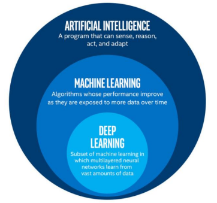
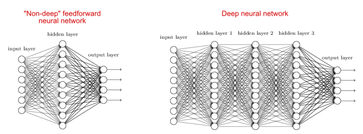
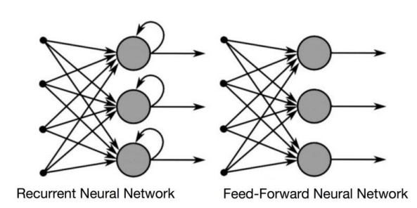
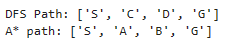

# W06 - Deep Learning







## Lecture Example 1: Single Neuron Network - W06_Lecture_Page18


In this code, the "neuron" refers to the perceptron, which is a basic unit in artificial neural networks. Let's break down how it's represented:

- Inputs: Imagine you have two switches labeled input1 and input2. These switches can either be on (1) or off (0). They represent the information the neuron receives.
```
for inputs, expected_output in zip(test_cases, expected_outputs):
#inputs;
#Loop1: [0, 0]
#Loop2: [0, 1]
#Loop3: [1, 0]
#Loop4: [1, 1]
```
- Weights: Each switch is connected to the neuron with a wire, and these wires have weights. These weights show how much attention the neuron pays to each switch. In our code, these weights are random numbers, deciding how much each input matters.
```
weights = np.random.rand(2)  # Random weights for two inputs
```
- Bias: Bias is like a natural inclination or tendency for the neuron to lean towards a certain decision regardless of the input. It acts as an extra push. In our code, bias is also a random number.
```
bias = np.random.rand()  # Random bias value
```
- Weighted Sum: The neuron calculates a total based on the inputs and their weights. It's like adding up the values from each switch, but some switches have more weight, so they count more in the total.
```
weighted_sum = np.dot(inputs, weights) + bias
```
- Activation Function: The neuron has a threshold for making decisions. If the total weighted sum is high enough (greater than 1), it decides to output 1, indicating "yes". If it's not high enough (less than or equal to 1), it outputs 0, indicating "no". This is similar to deciding if there's enough energy to turn on a light bulb.
```
def activation_function(x):
    return 1 if x > 1 else 0
```
- Output: The final result, either 1 or 0, shows what the neuron thinks based on the inputs, weights, bias, and activation function. In our case, it's predicting whether the logical AND operation of the inputs should result in 1 or 0.
```
output = activation_function(weighted_sum)
```

So, the neuron is like a decision-making gadget. It takes inputs, considers their importance (weights), adds a bit of bias, makes a decision using an activation function, and gives an output.


### Code of 'Lecture Example 1':

```
### Lecture Example 1: Single Neuron Network - W06_Lecture_Page18

# A perceptron for the logical AND operation of its input
import numpy as np

# Define an activation function called 'activation_function'.
# This function returns 1 if the input 'x' is greater than 1, otherwise it returns 0.
def activation_function(x):
    # Step activation function
    return 1 if x > 1 else 0

# Define a function called 'predict' to make predictions using the perceptron.
# It calculates the weighted sum of inputs, adds bias, and then applies the activation function.
def predict(inputs, weights, bias):
    # Calculate the weighted sum of inputs
    weighted_sum = np.dot(inputs, weights) + bias
    # Apply the activation function to the weighted sum and return the result
    return activation_function(weighted_sum)

# Initialize weights with random values using numpy's random number generator
weights = np.random.rand(2)
# Initialize bias with a random value
bias = np.random.rand()

# Define a function to test the perceptron with logical AND operation
def test_logical_and():
    # Define the truth table for logical AND operation
    test_cases = [[0, 0], [0, 1], [1, 0], [1, 1]]
    # Define the expected outputs for each test case
    expected_outputs = [0, 0, 0, 1]

    # Test each case
    for inputs, expected_output in zip(test_cases, expected_outputs):
        # Predict the output using the perceptron
        output = predict(inputs, weights, bias)
        # Print the inputs, predicted output, and expected output for each test case
        print(f"Inputs: {inputs}, Predicted Output: {output}, Expected Output: {expected_output}")

# Check if this script is being run directly
if __name__ == "__main__":
    # Call the 'test_logical_and' function to run the test cases
    test_logical_and()


'''
Output explanation: 

The issue with the predictions not being correct is likely due to the initial random initialization 
of weights and bias. When you initialize the weights and bias randomly, they are not necessarily set 
to values that enable the perceptron to learn the correct logic for the AND operation immediately.
'''
print("")

```

## Lecture Example 2: Multiple Layer Neural Network - W06_Lecture_Page19


In this code, neurons are represented implicitly within the MLPClassifier model. Let's break down how neurons interact, learn, and make predictions within the context of this code:

- Representation of Neurons:
Neurons are not explicitly represented in the code; rather, they are encapsulated within the MLPClassifier model provided by scikit-learn. Each neuron in the hidden layers of the neural network is responsible for computing a weighted sum of its inputs and passing the result through an activation function.
```
clf = MLPClassifier(hidden_layer_sizes=(5, 2), activation='relu', solver='adam', max_iter=10000, random_state=1)
```

- Contact Between Neurons:
Neurons in adjacent layers are connected via weighted connections. Each connection between neurons carries a weight that determines the strength of the connection. These weights are adjusted during the training process to optimize the performance of the neural network.

- Learning Process:
The learning process involves iteratively presenting input data (features) to the neural network and comparing the predicted outputs with the actual outputs (labels). This comparison allows the network to calculate an error, which is then used to adjust the weights of the connections between neurons using optimization algorithms like the Adam optimizer.
During training, the network's weights are updated in such a way that the error between predicted and actual outputs is minimized. This process of weight adjustment allows the neural network to learn the underlying patterns in the data and improve its predictive performance over time.

- Making Predictions:
Once the neural network is trained, it can make predictions on new, unseen data. When presented with input data, the network passes the data through its layers of neurons, computing weighted sums and applying activation functions at each layer. The final output of the network is the prediction made by the output layer neurons.
In summary, while the code itself does not explicitly represent individual neurons, the MLPClassifier model encapsulates the behavior of neurons within its hidden layers. Through the process of iterative training and weight adjustment, these neurons learn to make accurate predictions by capturing the underlying patterns in the data.

### Code of 'Lecture Example 2':

```
### Lecture Example 2: Multiple Layer Neural Network - W06_Lecture_Page19

# Import necessary libraries
from sklearn.neural_network import MLPClassifier  # Import the MLPClassifier class from scikit-learn
import numpy as np  # Import the NumPy library for numerical operations

# Define the logical AND truth table
X = np.array([[0, 0],  # Input combinations for logical AND operation
              [0, 1],
              [1, 0],
              [1, 1]])
y = np.array([0, 0, 0, 1])  # Corresponding output for logical AND operation


# Create and configure the MLPClassifier
clf = MLPClassifier(hidden_layer_sizes=(5, 2),  # Define the architecture of the neural network with  
                                                # 2 hidden layers containing 5 and 2 neurons respectively
                    activation='relu',  # Use Rectified Linear Unit (ReLU) activation function for hidden layers
                                        # Here, 'relu' stands for REctified Linear Unit, which is a popular activation 
                                        # function that introduces non-linearity into the neural network.
                    solver='adam',  # Use Adam optimizer for training the neural network.
                                    # This parameter specifies the optimization algorithm 
                                    # used to train the neural network. 'adam' refers to the 
                                    # Adam optimizer, which is an efficient and effective optimization 
                                    # algorithm commonly used for training neural networks.
                    max_iter=10000,  # Maximum number of iterations for training
                                     # Each iteration involves forward and backward 
                                     # passes through the network to adjust the weights. 
                    random_state=1)  # Set random seed for reproducibility

# Train the classifier
clf.fit(X, y)  # Train the neural network on the provided input-output pairs


# Test the trained classifier
test_cases = [[0, 0], [0, 1], [1, 0], [1, 1]]  # Test input combinations
for inputs in test_cases:
    output = clf.predict([inputs])[0]  # Predict the output using the trained classifier
    print(f"Inputs: {inputs}, Predicted Output: {output}")  # Print the input combination and predicted output
```

### Tutorial Example 1: Single Neuron Network (logical OR) - W06_Tutorial_Page3

```
### Tutorial Example 1: Single Neuron Network (logical OR) - W06_Tutorial_Page3

# Import the numpy library for numerical operations
import numpy as np

# Define an activation function called 'activation_function'.
# This function returns 1 if the input 'x' is greater than 1, otherwise it returns 0.
def activation_function(x):
    # Step activation function
    return 1 if x > 1 else 0

# Define a function called 'predict' to make predictions using the perceptron.
# It calculates the weighted sum of inputs, adds bias, and then applies the activation function.
def predict(inputs, weights, bias):
    # Calculate the weighted sum of inputs
    weighted_sum = np.dot(inputs, weights) + bias
    # Apply the activation function to the weighted sum and return the result
    return activation_function(weighted_sum)

# Initialize weights with random values
weights = np.random.rand(2)  # Random weights for two inputs
bias = np.random.rand()  # Random bias value

# Test the perceptron with Logical OR operation
def test_logical_Or():
    # Logical OR truth table
    test_cases = [[0, 0], [0, 1], [1, 0], [1, 1]]
    expected_outputs = [0, 1, 1, 1]

    # Test each case
    for inputs, expected_output in zip(test_cases, expected_outputs):

#for reference:
        # Print the initial values of inputs, weights, and bias for reference
        print("Inputs: ",inputs)
        print("Weights: ",weights)
        print("Bias: ",bias)
        
        # Calculate the weighted sum of inputs and print
        weighted_sum = np.dot(inputs, weights) + bias
        print("Weighted Sum: ", weighted_sum)
        
        # Apply activation function based on the weighted sum and print the result
        if weighted_sum > 1:
            print("Activation Function (if Weighted Sum > 1): ", 1)
        else:
            print("Activation Function (if Weighted Sum > 1): ", 0)
# end for reference.
        
        # Predict the output using the perceptron and print
        output = predict(inputs, weights, bias)
        # Print the inputs, predicted output, and expected output for each test case
        print(f"Inputs: {inputs}, Expected Output: {expected_output}, Predicted Output: {output}")
        print("")

# Check if this script is being run directly
if __name__ == "__main__":
    test_logical_Or()

```

### Tutorial Example 2: Multiple Layer Neural Network (logical XOR) - W06_Tutorial_Page4
```

```


Output:




